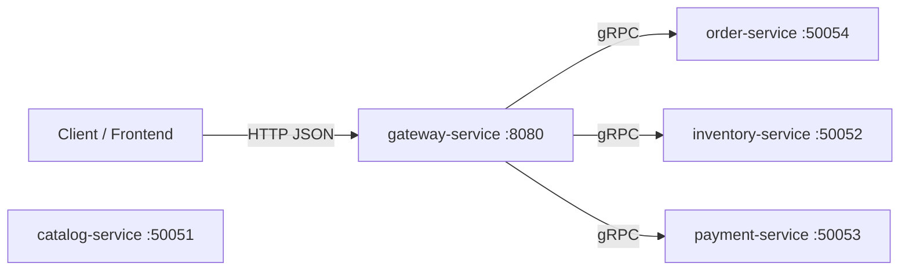
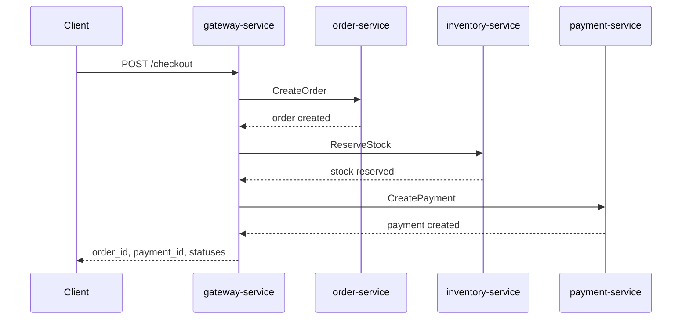

# Event-Driven Ecommerce App

Go-based ecommerce backend prototype built with:
- `Gin` for the public HTTP API gateway
- `gRPC` for internal service-to-service communication
- separate services for `gateway`, `order`, `inventory`, `payment`, and `catalog`

## Main Idea

The goal of this project is to model an ecommerce backend as a set of independent services with clear responsibilities.

Today, the system works as a **synchronous microservices prototype**:
- the client talks only to `gateway-service`
- the gateway coordinates business operations across internal services
- services communicate through gRPC
- each service owns its own part of the domain

The long-term direction is to evolve this into a real **event-driven architecture** with Kafka, persistent storage, and asynchronous workflows.

## How It Works Now

The current business flow is centered around the gateway.

### Current interaction model



Important note:
- services do not call each other directly yet
- the gateway acts as the orchestrator
- this is not fully event-driven yet

## Main Flow Example

The most important flow in the project right now is checkout.

### Checkout flow



If a later step fails:
- the gateway releases reserved stock
- the gateway cancels the order

So the current flow is:
- synchronous
- orchestrated
- compensation-based on failure

## Services

### `gateway-service`
- public HTTP entrypoint
- validates requests
- translates HTTP to gRPC
- orchestrates checkout flow
- exposes health and readiness endpoints

### `order-service`
- creates orders
- gets order by ID
- lists customer orders
- cancels orders

### `inventory-service`
- reserves stock
- releases stock
- owns stock quantities

### `payment-service`
- creates payments
- gets payment by ID
- handles payment idempotency

### `catalog-service`
- exposes product catalog data
- currently not part of the checkout flow

## Project Structure

```text
api/              protobuf definitions
cmd/              service entrypoints
gen/              generated protobuf and gRPC code
internal/         application code
  gateway/        HTTP handler, orchestration, gRPC clients
  order/          order domain, repository, service, handler
  inventory/      inventory domain, repository, service, handler
  payment/        payment domain, repository, service, handler
  catalog/        catalog domain, repository, service, handler
Makefile          developer commands
roadmap.md        next implementation steps
```

## What Is Already Implemented

- HTTP API gateway
- gRPC internal communication
- checkout orchestration
- order lookup
- customer order history with pagination
- order cancel endpoint
- health and readiness endpoints
- request ID propagation across HTTP and gRPC
- in-memory repositories for fast local development

## What Is Missing

To fully match the project name, the app still needs:
- Kafka-based event flow
- asynchronous business processing
- PostgreSQL, MongoDB, and Redis runtime integration
- outbox pattern
- idempotent event consumers

## Running

Main commands:

```bash
make help
make build
make test
make run-catalog
make run-inventory
make run-payment
make run-order
make run-gateway
```

Then the gateway is available on:

```text
http://localhost:8080
```

## Current Summary

This project is best described today as:

> a Go microservices ecommerce backend with an HTTP gateway, gRPC service boundaries, synchronous checkout orchestration, and a clear path toward event-driven architecture

That is the current truth of the system and the direction it is being built toward.
