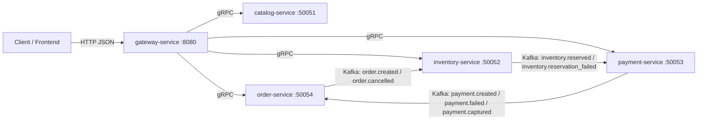
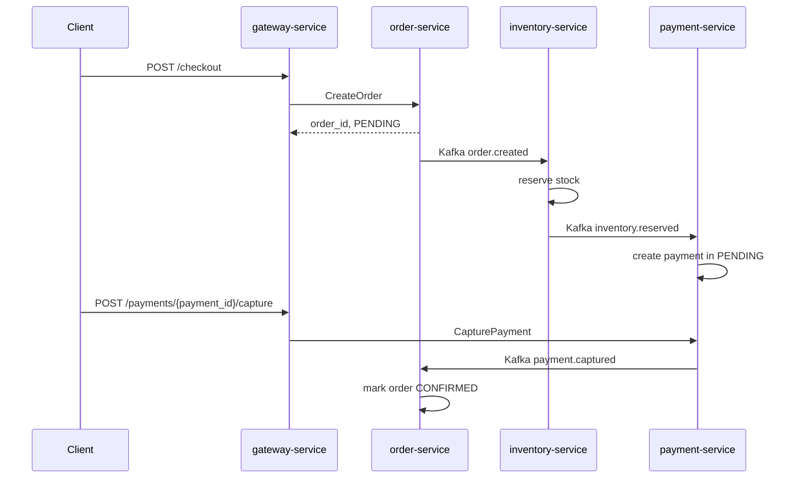

# Event-Driven Ecommerce App

Go-based ecommerce backend prototype built with:
- `Gin` for the public HTTP API gateway
- `gRPC` for internal service-to-service communication
- `PostgreSQL` for shared transactional persistence across local services
- `Kafka` via Redpanda for asynchronous workflow events
- `Redis` for event deduplication

## Current Architecture

This project is no longer a synchronous checkout prototype.

Today, the main business flow is **asynchronous and event-driven**:
- the client talks to `gateway-service`
- the gateway creates an order through `order-service`
- `order-service` writes `order.created` to its outbox
- `inventory-service` consumes that event and reserves stock
- `payment-service` consumes `inventory.reserved` and creates a `PENDING` payment
- payment outcome is triggered explicitly through payment actions
- `order-service` reacts to `payment.captured` and `payment.failed`

## Service Topology


```mermaid
flowchart LR
    Client["Client / Frontend"] -->|HTTP JSON| Gateway["gateway-service :8080"]
    Gateway -->|gRPC| Catalog["catalog-service :50051"]
    Gateway -->|gRPC| Order["order-service :50054"]
    Gateway -->|gRPC| Inventory["inventory-service :50052"]
    Gateway -->|gRPC| Payment["payment-service :50053"]

    Order -->|Kafka: order.created / order.cancelled| Inventory
    Inventory -->|Kafka: inventory.reserved / inventory.reservation_failed| Payment
    Payment -->|Kafka: payment.created / payment.failed / payment.captured| Order
```

## Main Checkout Flow


```mermaid
sequenceDiagram
    participant C as Client
    participant G as gateway-service
    participant O as order-service
    participant I as inventory-service
    participant P as payment-service

    C->>G: POST /checkout
    G->>O: CreateOrder
    O-->>G: order_id, PENDING
    O->>I: Kafka order.created
    I->>I: reserve stock
    I->>P: Kafka inventory.reserved
    P->>P: create payment in PENDING
    C->>G: POST /payments/{payment_id}/capture
    G->>P: CapturePayment
    P->>O: Kafka payment.captured
    O->>O: mark order CONFIRMED
```

Failure path:
- `inventory.reservation_failed` cancels the order
- `payment.failed` cancels the order
- `order.cancelled` triggers inventory release

## Service Responsibilities

### `gateway-service`
- public HTTP entrypoint
- request validation
- HTTP -> gRPC translation
- payment capture through HTTP
- health and readiness endpoints

### `order-service`
- creates orders
- persists outbox events
- tracks order state transitions
- consumes inventory and payment outcome events

### `inventory-service`
- owns stock state
- reserves and releases inventory
- consumes `order.created` and `order.cancelled`
- publishes inventory reservation outcomes

### `payment-service`
- creates payments in `PENDING`
- supports manual `CAPTURED`, `FAILED`, and `CANCELLED` transitions
- consumes `inventory.reserved`
- publishes payment outcome events

### `catalog-service`
- stores catalog products in Postgres
- serves product reads and product CRUD

## Local Stack

`compose.yaml` starts:
- `postgres` on `localhost:5432`
- `redpanda` on `localhost:19092`
- `redpanda-console` on `http://localhost:8081`
- `redis` on `localhost:6379`

## Prerequisites

Local tooling:
- Go
- Docker / Docker Compose
- `migrate`
- `protoc` with `protoc-gen-go` and `protoc-gen-go-grpc`
- `sqlc`

Check tooling with:

```bash
make doctor
```

## Run Everything Locally

### 1. Start Kafka, Redis, and Postgres

```bash
make kafka-up
make db-prepare
```

### 2. Seed demo catalog and inventory data

```bash
make db-seed-demo
```

This creates:
- catalog products: `prod-1`, `prod-2`
- inventory stock rows for the same product IDs

### 3. Start services in separate terminals

```bash
make run-catalog
make run-inventory
make run-payment
make run-order
make run-gateway
```

Gateway:

```text
http://localhost:8080
```

### 4. Create an order

```bash
curl -X POST http://localhost:8080/checkout \
  -H 'Content-Type: application/json' \
  -d '{
    "customer_id": "cust-1",
    "idempotency_key": "checkout-1",
    "items": [
      {
        "product_id": "prod-1",
        "sku": "demo-coffee",
        "product_name": "Demo Coffee Beans",
        "quantity": 2,
        "unit_price": {
          "currency": "USD",
          "amount_cents": 1599
        }
      }
    ],
    "shipping_address": {
      "country": "US",
      "city": "New York",
      "street": "Main Street",
      "postal_code": "10001",
      "house": "1",
      "apartment": "2A"
    },
    "payment": {
      "method": "CARD",
      "method_details": "tok_demo"
    }
  }'
```

Expected immediate result:
- order is created
- initial order status is `PENDING`

### 5. Get the payment for that order

```bash
curl http://localhost:8080/orders/<order_id>/payment
```

Expected result:
- payment exists
- payment status is `PENDING`

### 6. Capture payment through the gateway

```bash
curl -X POST http://localhost:8080/payments/<payment_id>/capture
```

Expected result:
- payment becomes `CAPTURED`
- `payment.captured` is published
- `order-service` consumes it
- order becomes `CONFIRMED`

### 7. Verify final order state

```bash
curl http://localhost:8080/orders/<order_id>
```

Expected result:
- `order_status = CONFIRMED`

## Manual Failure Flow

There is currently **no HTTP fail-payment endpoint** on the gateway.

To test payment failure, call `payment-service` directly with `grpcurl`:

```bash
grpcurl -plaintext \
  -d '{"payment_id":"<payment_id>","reason":"card declined"}' \
  localhost:50053 payment.v1.PaymentService/FailPayment
```

Then verify the order:

```bash
curl http://localhost:8080/orders/<order_id>
```

Expected result:
- payment becomes `FAILED`
- `payment.failed` is published
- order becomes `CANCELLED`

## Useful Commands

```bash
make help
make lint
make build
make test
make proto
make sqlc-generate
make kafka-logs
make db-logs
make db-migrate-version
```

## Current Summary

This project is best described today as:

> a Go microservices ecommerce backend with a Gin gateway, gRPC service boundaries, Postgres-backed services, Kafka-driven order/inventory/payment workflow, and manual payment outcome simulation for local testing
